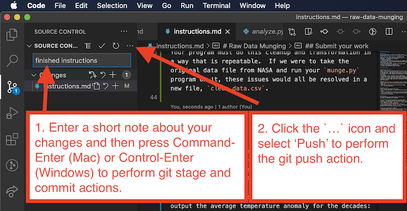

# Instructions

A little assignment to practice importing and analyzing data within a MongoDB database.

The goals of this assignment are to:

- gain experience working with real world data sets
- import the text data file into MongoDB document-oriented database collection
- perform queries in MongoDB to gain insights present in the data

## Part 1: Data selection and import

### The data source

In this assignment, you will work with [AirBnB listings data](http://insideairbnb.com/get-the-data.html) from a city of your choosing.

### Save the data

Save the raw data file of your choice into the `data` directory.

1. Select a city of interest to you.
1. Download the appropriate data file - it will be named `listings.csv.gz` - this is a `csv` file compressed with `gzip` compressino.

### Upload the data file to i6

In order to import this data into a MongoDB database, we must first upload it to our web server from which we will connect to the MongoDB sever.

1. Use a file transfer program, such as [Cyberduck](https://cyberduck.io/), to transfer this compressed file to your account on the **i6**.cims.nyu.edu web server.
1. Log into the **i6** server using `ssh`, and unzip this file with the command, `gunzip listings.csv.gz` - this will result in a file named `lsitings.csv` in the same directory.

### Data scrubbing

Take a look at the data in the data file. If you decide it needs any scrubbing, perform that scrubbing using any tool you wish. Save the scrubbed version in a file named `listings_clean.csv`.

If you use any Python or other programs to help scrub the data, include those program files in the main directory of the project.

Keep track of any changes you make to the data while scrubbing - you will include these details in a report.

### Import the data into a MongoDB collection

Use the following command to import the data into a MongoDB collection on the database server. This import may take a few minutes, if the file is very large.

```bash
mongoimport --headerline --type=csv --db=your_db_name --collection=listings --host=your_db_host --file=listings.csv --username=your_db_username --password=your_db_password
```

- replace `your_db_host` with the host name of your database, `class-mongodb.cims.nyu.edu`.
- replace `your_db_name` with your database name, your NYU Net ID.
- replace `your_db_username` with your database username, your NYU Net ID.
- replace `your_db_password` with your database password.
- if you have scrubbed the data, replace the `listings.csv` file name with your scrubbed version, `listings_clean.csv`.

## Part 2: Data analysis in MongoDB

Use the `mongo` command line client to run the following queries - save both the query and the first 3 result documents to include in your report later.

1. show exactly two documents from the `listings` collection in any order
1. show exactly 10 documents in any order, but print in easier to read format and noting the host names for further use, using the `pretty()` function.
1. choose two `host_names` who are superhosts (available in the `host_is_superhost` field), and show all of the listings offered by either of the two hosts
   - only show the `name`, `price`, `neighbourhood`, `host_name`, and `host_is_superhost` for each result
1. find all the unique `host_name` values (see [the docs](https://docs.mongodb.com/manual/reference/method/db.collection.distinct/))
1. find all of the places that have more than 2 `beds` in a neighborhood of your choice (referred to as `neighbourhood_group_cleansed` in the data file), ordered by `review_scores_rating` descending
   - only show the `name`, `beds`, `city`, `review_scores_rating`, and `price`
   - if you run out of memory for this query, try filtering `review_scores_rating` that aren't empty (`$ne`); and lastly, if there's still an issue, you can set the `beds` to match exactly 2
1. show the number of listings per host
1. in a particular `neighborhood_group_cleansed` of your choosing again, find the average `review_scores_rating` per neighborhood, and only show the ones above a 95, sorted in descending order of rating (see [the docs](https://docs.mongodb.com/manual/reference/operator/aggregation/sort/))

### Write a report

Write a report which displays the data and the results in the file named [README.md](./README.md).

This report should be well-written and well-formatted using Markdown code - refer to this [guide to using Markdown](https://guides.github.com/features/mastering-markdown/).

The report must include:

Data set details:

- The origin of your data set - what is it and where does it come from. Include a link to the URL of the source.
- What format the original data file was in (CSV, JSON, or other).
- Display some of the raw data from the original data file (the first 20 rows is enough). Use Markdown's ability to display tables - see the examples in the Markdown guide linked above.
- Describe any problems that were present in the data and the scrubbing tasks that were necessary to prepare your data set for import - include any scrubbing done in Python, a text editor, or any other tool. Be specific with examples of the problems in the original data and the way in which those were solved. Feel free to show small snippets of relevant code - see the examples of code "syntax highlighting" in the Markdown guide linked above.

Analysis:

- Describe each of the analyses you have performed - include a description of each, include the code used to perform it, and describe any insights the analysis shows that may not be obvious to someone just viewing the raw data.

## Part 3: Extra credit

For extra credit, you can optionally use Python to connect to the MongoDB database and perform some of the queries in your analysis.

### Set up a Python virtual environment

A virtual environment is a sort of **clean slate** Python programming environment, within which you can install Python modules for your project in a way that does not conflict with other modules you or others have installed for other purposes.

On **i6**, create and activate a new virtual environment with the name `.venv`:

```bash
python3 -m venv .venv
source .venv/bin/activate
```

Install the `pymongo` module to allow Python to connect to MongoDB.

```bash
pip3 install pymongo
```

### Set up your Python program

The code below shows how to connect from Python to a MongoDB database using `pymongo` module. Replace the database credentials below with the correct values for your account:

```python
import pymongo
connection = pymongo.MongoClient("your_db_host", 27017,
                                username="your_db_username",
                                password="your_db_password",
                                authSource="your_db_name")
collection = connection["your_db_name"]]["your_db_collection_name"]

# the collection variable will be a reference to your collection
docs = collection.find({}).limit(10) # get the first 10 documents
print(docs)
```

Read [the pymongo docs](https://pymongo.readthedocs.io/en/stable/index.html) to learn more.

### Recreate analyses

Reproduce one of your earlier queries:

- find all of the places that have more than 2 `beds` in a neighborhood of your choosing, ordered by `review_scores_rating` descending
- only show the `name`, `beds`, `city`, `review_scores_rating`, and `price`
- note that in `pymongo`, you'll have to quote all of your keys.

### Requesting extra credit

If you believe you deserve extra credit, include a sub-heading at the bottom of your `README.md` document explaining why you believe you deserve it.

```markdown
...

## Extra-credit

This assignment deserves extra credit because iste numquam eos et repudiandae sint enim. Rerum enim voluptas voluptatem consequuntur. Sed atque deserunt nihil eius neque et provident aspernatur. Incidunt iusto beatae illo minus vel. Quis sint sunt et facilis doloribus eligendi error est. Ipsum similique.
...
```

## Submit your work

Each student must submit this assignment individually. Use Visual Studio Code to perform git `stage`, `commit` and `push` actions to submit. These actions are all available as menu items in Visual Studio Code's Source Control panel.

1. Type a short note about what you have done to the files in the `Message` area, and then type `Command-Enter` (Mac) or `Control-Enter` (Windows) to perform git `stage` and `commit` actions.
1. Click the `...` icon next to the words, "Source Control" and select "Push" to perform the git `push` action. This will upload your work to your repository on GitHub.com.

Be sure to include the following:

- The original plain text data file which you downloaded from the Internet. Place this within the `data` directory.
- If you performed any scrubbing of the data, include the any Python programs you used for scrubbing the data file placed within the main project directory, as well as the scrubbed data file itself, named `listings_clean.csv`, also within the `data` directory.
- your report in the file named [README.md](./README.md).


